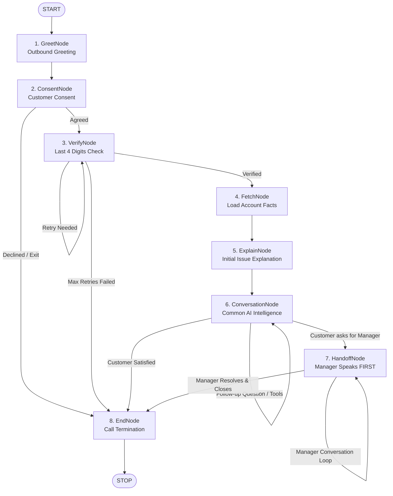
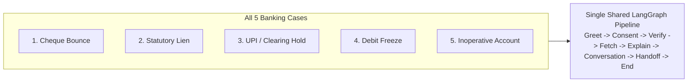

# Sahayak Voice V2 — Comprehensive Codebase Guide

## 1. Project Purpose

Sahayak Voice V2 is an autonomous, outbound Voice AI Relationship Manager built specifically for Indian Retail Banking. It contacts customers to inform them about critical account issues (such as returned cheques, statutory tax liens, clearing holds, KYC debit freezes, or dormant inoperative accounts). It conducts identity verification securely, explains the issue clearly in spoken Gujarati, answers arbitrary customer questions using grounded facts, requests authorized banking tools, and seamlessly escalates to a Senior Relationship Manager with automatic context transfer.

---

## 2. V1 vs V2 Comparison

| Dimension | Sahayak Voice V1 | Sahayak Voice V2 |
|---|---|---|
| **Location** | `backend/app` & `frontend/` (Frozen) | `v2/backend` & `v2/frontend` (Independent) |
| **Agent Architecture** | Multi-layered legacy orchestrator with dozens of helper modules | Clean LangGraph `StateGraph(CallState)` with 8 dedicated node files |
| **Five Cases Workflow** | Shared playbook with fragmented case resolvers | **Single, unified workflow** for all 5 cases; only facts/context vary |
| **Human Handoff** | Required extra customer turn ("hello") to wake manager | **Manager speaks FIRST automatically** with prior context |
| **Manager Mode** | Mode flags interleaved in legacy dialog coach | Explicit `callMode = "human"`; AI conversation stopped |
| **Verification** | Spread across digits parser and verify files | Self-contained, deterministic verify node with full Gujarati spoken number support |
| **Language** | Enforced via post-processing filters | Gujarati-first system prompts, grounding, and TTS voice selection |
| **Code Style** | Complex inheritance and custom abstractions | Fresh, beginner-friendly Python with simple functions and no leading underscores |

---

## 3. Architecture & LangGraph StateGraph

### Complete Workflow Diagram

---

## 4. Node Responsibilities

### 1. `greet.py` (`greetCustomer`)
- Commences the outbound call.
- Greets the customer warmly by name in Gujarati.
- Uses `topicPhrase()` to mention the issue softly without revealing sensitive data before verification.
- Transitions to `phase = "consent"`.

### 2. `consent.py` (`getConsent`)
- Checks if the customer is available to speak.
- If customer agrees ("હા", "બોલો", "ચોક્કસ", "sure"): asks for the last 4 account digits and moves to `verify`.
- If customer declines ("હમણાં નહીં", "વ્યસ્ત છું", "no"): politely exits.
- If customer asks why: provides a reassuring explanation about account security.

### 3. `verify.py` (`verifyCustomer`)
- Deterministic verification boundary. The LLM cannot set `verified = True`.
- Understands:
  - Spoken compound numbers: e.g. `"સાત હજાર બસો ને ચોરાણું"` → `7294`.
  - Spoken digit-by-digit: e.g. `"ચાર પાંચ બે એક"` → `4521`.
  - Gujarati script numerals: e.g. `"૪૫૨૧"` → `4521`.
  - ASCII numerals: `"4521"`.
- If matched: marks `verified = True` and transitions to `fetch`.
- If wrong: allows up to 2 retries, then politely terminates for security.

### 4. `fetch.py` (`fetchAccount`)
- Loads authorized account snapshot from `getAccountSnapshot(accountId)`.
- Updates `accountFacts`, `customerName`, `caseType`.
- Direct SQL execution is prohibited.

### 5. `explain.py` (`explainIssue`)
- Delivers the initial factual explanation of the case:
  - **Cheque Bounce**: cheque number, amount, payee, bounce date, NSF reason, charges.
  - **Lien**: statutory tax attachment reference, lien amount, usable balance.
  - **Hold**: UPI settlement verification, hold amount, resolution ETA.
  - **Debit Freeze**: periodic KYC pending, branch documents needed.
  - **Inoperative**: 2-year dormancy, zero reactivation fee, balance safety.
- Transitions to `phase = "conversation"`.

### 6. `conversation.py` (`handleConversation`)
- The single, common conversational intelligence engine for all 5 cases.
- Powered by `CONVERSATION_SYSTEM_PROMPT` + grounded account facts + conversation memory.
- Handles:
  - Multi-part queries (e.g. why lien + usable amount + scam doubts).
  - Objections and confusion.
  - Authorized tool requests (e.g. `get_balances`, `get_cheque_status`, `create_demo_service_request`).
  - Handoff requests: detects human request ("મેનેજર", "અધિકારી", "manager") and sets `handoffRequested = True`.
  - Call ending signals: detects closing words ("આભાર", "સમજાઈ ગયું") and transitions to `end`.

### 7. `handoff.py` (`handleHandoff`)
- Human escalation handler:
  - **MANAGER SPEAKS FIRST**: Upon connection, manager immediately introduces themselves ("નમસ્તે Hardikભાઈ! હું વિક્રમ મહેતા બોલું છું, સિનિયર મેનેજર...").
  - **Customer does NOT have to say "hello"**.
  - Sets `callMode = "human"`; normal AI node stops.
  - Manager receives customer name, case facts, and previous unanswered question.
  - Handles customer replies in human mode and naturally closes the call when customer is satisfied.

### 8. `end.py` (`endCall`)
- Final clean shutdown: sets `callEnded = True`, `callMode = "ended"`, `phase = "end"`.
- Delivers polite closure: `"સહાયક બેંક સાથે વાત કરવા બદલ આભાર. તમારો દિવસ શુભ રહે!"`.

---

## 5. The Five Retail Banking Cases

All five cases use the **exact same LangGraph pipeline**:

1. **Cheque Bounce (`ACC-CHQ-HARDIK`)**:
   - Customer: Hardik Patel (Expected Last 4: `7294`)
   - Cheque No: 847293, Amount: ₹49,847, Payee: Rajesh Traders
   - Reason: NSF (Insufficient Funds), Bounce Fee: ₹523
2. **Statutory Lien (`ACC-LIEN-PRIYA`)**:
   - Customer: Pratik Sharma (Expected Last 4: `4521`)
   - Authority: Income Tax Department, Ref: IT-ATTACH-2026-8891
   - Lien Amount: ₹38,419, Available Usable Balance: ₹14,364
3. **Hold / UPI Pending (`ACC-HOLD-AMIT`)**:
   - Customer: Amit Singh (Expected Last 4: `5619`)
   - Ref: UPI-HOLD-2026-3021, Hold Amount: ₹19,847
   - Reason: Merchant UPI dispute settlement verification
4. **Debit Freeze (`ACC-FREEZE-VIKRAM`)**:
   - Customer: Vikram Mehta (Expected Last 4: `3182`)
   - Reason: Periodic KYC Re-verification Pending
   - Branch Visit: Required with Aadhaar + PAN
5. **Inoperative Account (`ACC-INOP-SUNITA`)**:
   - Customer: Sunil Rao (Expected Last 4: `8920`)
   - Reason: 2 years without debit/credit transaction
   - Reactivation: KYC submission at home branch, ₹0 charge

---

## 6. Frontend & WebSocket Integration

- **Frontend**: Next.js 15 App Router (`v2/frontend/`).
- **Visual Reference**: Reuses the exact, polished layout from V1 (customer rail, account details, voice activity indicators, live streaming text reveal).
- **Speaker Badges**: Displays `"Senior Manager"` when `callMode = "human"` or speaker is `"Senior Manager"`.
- **WebSocket Route**: `ws://localhost:8001/ws/voice/{sessionId}`.
- **REST Endpoints**:
  - `GET /api/health`: Health status.
  - `GET /api/scenarios`: Returns the 5 banking scenarios.
  - `POST /api/sessions`: Starts a call session.

---

## 7. Testing Summary

The test suite in `v2/tests/` verifies 100% of the required functionality:
- `test_five_cases_e2e.py`: 5 passed E2E tests for Cheque Bounce, Lien, Hold, Debit Freeze, and Inoperative Account.
- `test_handoff_manager.py`: 3 passed tests verifying manager speaks first, receives context, and closes call.
- `test_verification.py`: 6 passed tests for Gujarati compound numbers, digit words, numerals, and retries.
- `test_tools_and_safety.py`: 5 passed tests for authorized tool execution and fact safety.
- **Total: 19 passed tests in 0.15s.**
